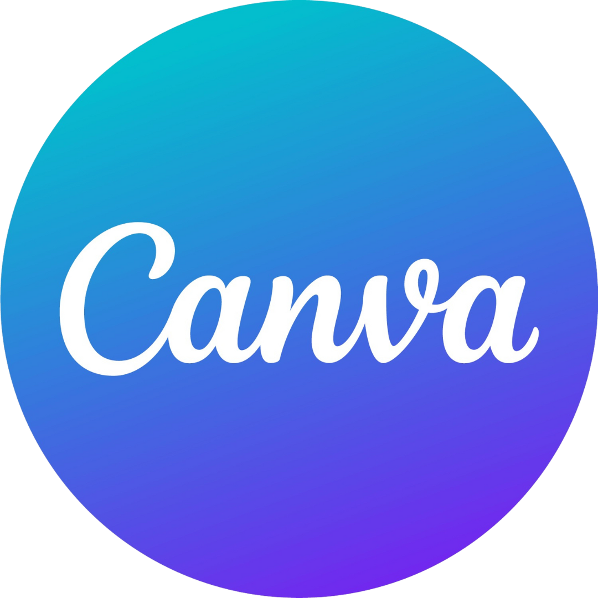
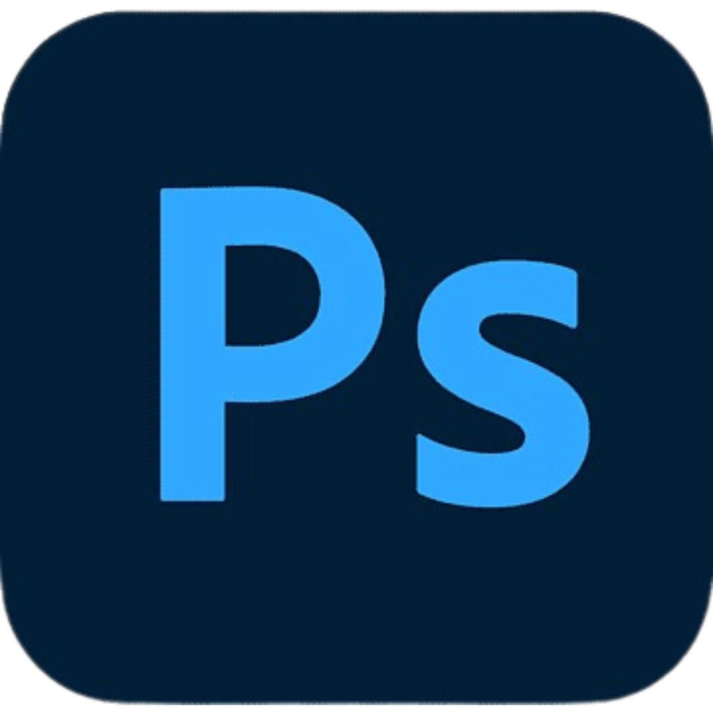

<h1 align="center">Olá  , eu sou o Humberto! </h1>

  
   

- Estudante de Ciência da Computação na FEI com experiência em diversas linguagens de programação. 
- Apaixonado por tecnologia e hardware, com habilidades em edição de vídeo e fotografia. 
- Experiência em liderança como Presidente do Diretório Acadêmico de Ciência da Computação.

  ## 👾| Experiências:

  

    
    
    
    
    
    
    
    
    
    
    
    
    
    
  

  ## 💻| Linguagens de programação que mais uso:

